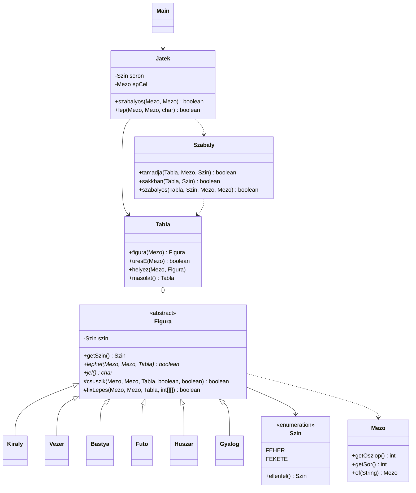

```mermaid
classDiagram
    class Figura {
        <<abstract>>
        -Szin szin
        +getSzin() Szin
        +lephet(Mezo, Mezo, Tabla)* boolean
        +jel()* char
        #csuszik(Mezo, Mezo, Tabla, boolean, boolean) boolean
        #fixLepes(Mezo, Mezo, Tabla, int[][]) boolean
    }
    Figura <|-- Kiraly
    Figura <|-- Vezer
    Figura <|-- Bastya
    Figura <|-- Futo
    Figura <|-- Huszar
    Figura <|-- Gyalog

    class Tabla {
        +figura(Mezo) Figura
        +uresE(Mezo) boolean
        +helyez(Mezo, Figura)
        +masolat() Tabla
    }
    class Mezo {
        +getOszlop() int
        +getSor() int
        +of(String) Mezo
    }
    class Szin {
        <<enumeration>>
        FEHER
        FEKETE
        +ellenfel() Szin
    }
    class Szabaly {
        +tamadja(Tabla, Mezo, Szin) boolean
        +sakkban(Tabla, Szin) boolean
        +szabalyos(Tabla, Szin, Mezo, Mezo) boolean
    }
    class Jatek {
        -Szin soron
        -Mezo epCel
        +szabalyos(Mezo, Mezo) boolean
        +lep(Mezo, Mezo, char) boolean
    }
    class Main

    Tabla o-- Figura
    Figura --> Szin
    Figura ..> Mezo
    Jatek --> Tabla
    Jatek ..> Szabaly
    Szabaly ..> Tabla
    Main --> Jatek
```